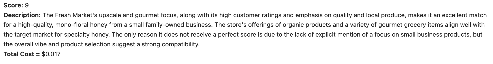

## Prompt Engineering

This directory stores files used for prompt engineering. The Assistants API notebook examined using Open AI's Assistant Endpoint. This endpoint turned out to be unnecessarily complex and costly, so I switched to the Chat Completions Endpoint. The Chat Completions API notebook is where I explored different prompts and evaluated the results against human benchmarks. The final prompt and sample output are shown below. 

#### Prompt

```python
client = OpenAI()

instructions = ("You are a helpful assistant tasked with helping us find grocery stores to stock our honey. We are a fourth-generation, family-owned apiary based out of northern Florida that specializes in the production of extremely high quality, mono-floral honey. We are looking for grocers that specialize in curating gourmet food products, especially from small businesses such as ours. Your task is to assign a compatibility score from 1-10 to the grocery store based on the {json} of store data we provide. The output should be a json with the score and a short description justifying why a given score was received.")

response = client.chat.completions.create(
    model="gpt-4-1106-preview",
    temperature=0.0,
    messages=[
        {"role": "system", "content": instructions},
        {"role": "user", "content": {test_json}}
  ]
)
```

**Model:** GPT-4 Turbo

**Prompt Tokens: ** 1345

**Output Tokens:** ~150

**Cost**: Input is \$0.01 per 1K tokens and output is \$0.03 per 1K tokens, so typical cost per run is $0.015.

#### Parsed Output

