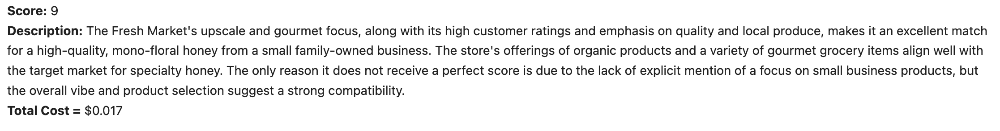
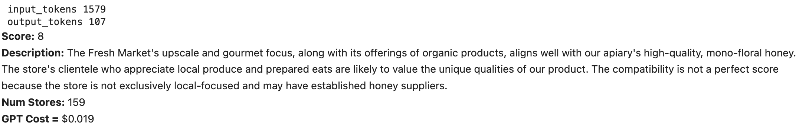
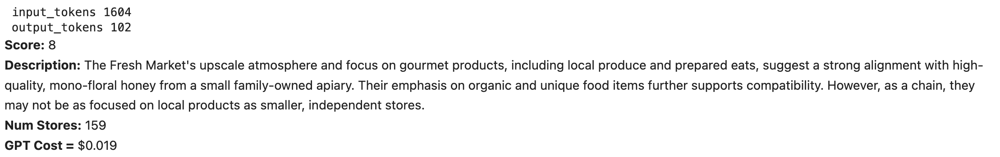

## Prompt Engineering

This directory stores files used for prompt engineering. The Assistants API notebook examined using Open AI's Assistant Endpoint. This endpoint turned out to be unnecessarily complex and costly, so I switched to the Chat Completions Endpoint. The Prompt Engineering notebook is where I explored different prompts and evaluated the results against human benchmarks. The different prompts and sample output are shown below. 

#### Prompt 1: Basic, Unstructured

Relying on GPT4's NLP ability to do a better job than I would do

```python
client = OpenAI()

instructions = ("You are a helpful assistant tasked with helping us find grocery stores to stock our honey. We are a fourth-generation, family-owned apiary based out of northern Florida that specializes in the production of extremely high quality, mono-floral honey. We are looking for grocers that specialize in curating gourmet food products, especially from small businesses such as ours. Your task is to assign a compatibility score from 1-10 to the grocery store based on the {json} of store data we provide. The output should be a json with the score and a short description justifying why a given score was received.")

response = client.chat.completions.create(
    model="gpt-4-1106-preview",
    temperature=0.0,
    messages=[
        {"role": "system", "content": instructions},
        {"role": "user", "content": {test_json}}
  ]
)
```

**Model:** GPT-4 Turbo

**Prompt Tokens:** 1345

**Output Tokens:** ~150

**Cost**: Input is \$0.01 per 1K tokens and output is \$0.03 per 1K tokens, so typical cost per run is $0.015.

#### Parsed Output



#### Prompt 2: Better formatting, estimate size

```python
client = OpenAI()

instructions = (
"""
Given the details of a grocery store provided in JSON format, please evaluate the compatibility of our fourth-generation, family-owned apiary based in northern Florida with the grocery store. Our apiary specializes in producing high-quality, mono-floral honey. We are targeting small grocers that curate gourmet food products, particularly from small businesses like ours. 

Your task is to:
1. Assign a compatibility score from 1 to 10, where 10 indicates the highest compatibility with our high-quality, mono-floral honey.
2. Provide a short description justifying the assigned compatibility score. This description should be a few sentences explaining why the grocery store is considered compatible or incompatible with our product.
3. Research and estimate the number of stores in the grocery store chain. This should be an integer value.

Please format your response as a JSON object with the following fields:
- "Compatibility Score": [An integer from 1 to 10 indicating the compatibility score]
- "Compatibility Description": [A short description in a few sentences justifying the assigned score]
- "Estimated Number of Stores": [An integer estimate of the number of stores in the chain]

For example, if the provided JSON data suggests a small, gourmet-focused grocer with a strong emphasis on supporting local small businesses, and it's part of a chain with 15 stores, your output should look something like this:

{
  "Compatibility Score": 9,
  "Compatibility Description": "The grocer's focus on gourmet products and support for local small businesses aligns well with our apiary's high-quality, mono-floral honey, making it a highly compatible partner.",
  "Estimated Number of Stores": 15
}

Note: Do not include any extraneous information such as research notes.
"""
)

response = client.chat.completions.create(
    model="gpt-4-1106-preview",
    temperature=0.0,
    messages=[
        {"role": "system", "content": instructions},
        {"role": "user", "content": test_json}
  ]
)
```


This prompt overvalues FL based stores, which all of these inputs are. It's overly optimistic with the potential to stock products without explicit mention. It does a good job estimating stores though.

#### Prompt 3: Don't overvalue FL stores. Don't assume gourmet without explicit mention

```python
client = OpenAI()

instructions = ("You are a helpful assistant tasked with helping us find grocery stores to stock our honey. "
                "We are a fourth-generation, family-owned apiary based out of northern Florida that specializes "
                "in the production of extremely high quality, mono-floral honey. We are looking for grocers that "
                "specialize in curating gourmet food products, especially from small businesses such as ours. "
                "Your task is to assign a compatibility score from 1-10 to the grocery store based on the {json} "
                "of store data we provide. The output should be a json with the score and a short description "
                "justifying why a given score was received.")

instructions = (
"""
You are a helpful assistant tasked with helping us find grocery stores to stock our honey. We are a fourth-generation, family-owned apiary based out of northern Florida that specializes in the production of extremely high quality, mono-floral honey. We are looking for grocers that specialize in curating gourmet food products, especially from small businesses such as ours.

Your task is to:
1. Assign a compatibility score from 1 to 10, where 10 indicates the highest compatibility with our high-quality, mono-floral honey.
2. Provide a short description justifying the assigned compatibility score. This description should be a few sentences explaining why the grocery store is considered compatible or incompatible with our product.
3. Research and estimate the number of stores in the grocery store chain. This should be an integer value.

Please format your response as a JSON object with the following fields:
- "Compatibility Score": [An integer from 1 to 10 indicating the compatibility score]
- "Compatibility Description": [A short description in a few sentences justifying the assigned score]
- "Estimated Number of Stores": [An integer estimate of the number of stores in the chain]

For example, if the provided JSON data suggests a small, gourmet-focused grocer with a strong emphasis on supporting local small businesses, and it's part of a chain with 15 stores, your output should look something like this:

{
  "Compatibility Score": 9,
  "Compatibility Description": "The grocer's focus on gourmet products and support for local small businesses aligns well with our apiary's high-quality, mono-floral honey, making it a highly compatible partner.",
  "Estimated Number of Stores": 15
}

Note: Do not include any extraneous information such as research notes.
Note: Large chains should be penalized.
Note: Stores that don't explicitly focus on gourmet should be penalized.
"""
)

response = client.chat.completions.create(
    model="gpt-4-1106-preview",
    temperature=0.0,
    messages=[
        {"role": "system", "content": instructions},
        {"role": "user", "content": test_json}
  ]
)
```



This prompt does well. Uses slightly more input tokens but input tokens are cheap. Final cost is comparable.