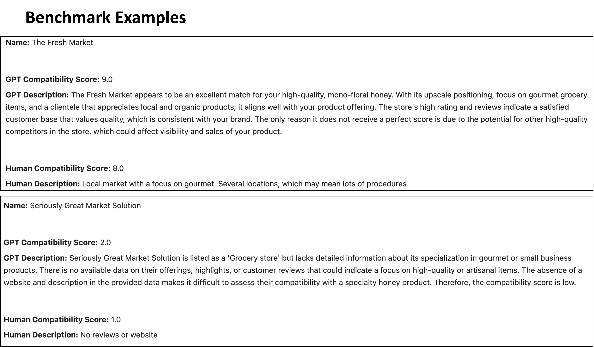

## Leveraging GPT and Web Scraping to Construct Comprehensive Market Contact Directories

This project uses Large Language Models (LLMs) and web-scraping APIs to create a detailed contact directory to connect buyers with sellers. We demonstrate this with a Florida-based family-owned apiary looking to partner with gourmet grocery stores interested in their products. The [resulting contact directory](https://chat.openai.com/c/link) includes store names, descriptions and compatibility scores generated by the LLM, as well as websites, addresses, phone numbers, and emails.

The algorithm starts by iterating through local Google search results using the search query "Gourmet Grocery Stores". The results from this search are then used to query the Google Place API, which provides verification of local businesses and additional information including websites, ratings, reviews, and addresses. This detailed information from the Place API is then processed and cleaned before being fed into an LLM (GPT-4) for compatability analysis using a prompt designed to match the product being sold with the ideal vendors .The prompt is benchmarked against human-evaluated data in order to ensure its effectiveness before being deployed across the entire dataset. The flowchart below illustrates this process.

